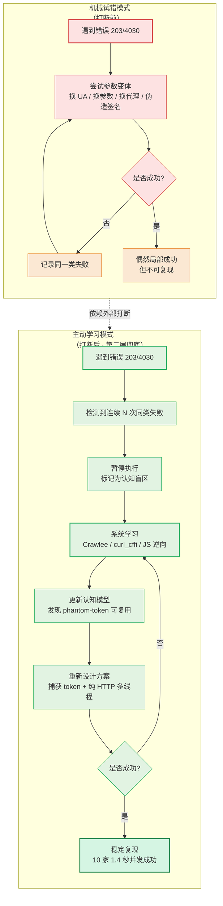
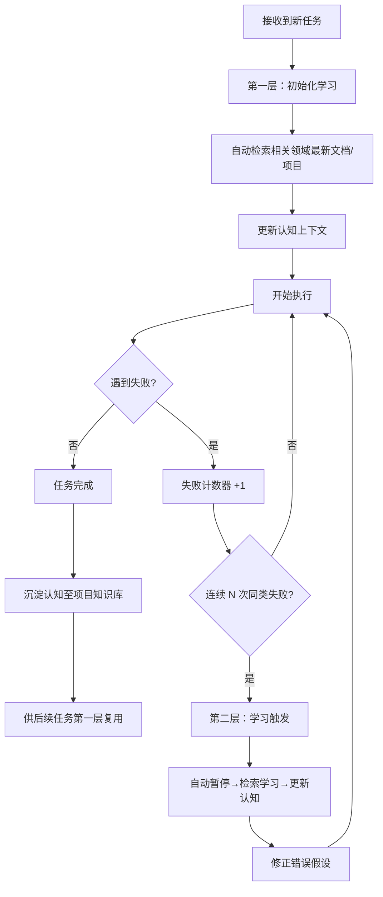

# AI 协作问题解决案例报告

**案例主题**：当 AI 反复报错时，"双层学习"（初始化预防 + 失败兜底）是否优于 "机械重试"？

**时间**：2026-08-05
**参与方**：用户（提出任务、提供判断） + AI Agent（执行、探索、学习、求解）
**案例来源**：携程酒店爬虫 "浏览器模式 → 纯 API 模式" 改造项目的完整实战对话
**实验仓库**：https://github.com/2003magic/ctrip-hotel-crawler

---

## 执行摘要

本案例对比了 AI 解决携程房态接口逆向难题时的两种模式：在用户打断干预前，AI 历经 **20+ 轮机械试错**（换 UA、换 TLS 指纹、换代理、伪造签名）全部失败；打断后转而**系统学习通用爬虫框架**（Crawlee、curl_cffi），一举识破 `phantom-token` 的真实机制，最终以纯 HTTP 多线程实现 **10 家酒店 1.4 秒并发成功**。

实验暴露了当前 Agent 的一个结构性短板：面对复杂问题时，模型倾向于在同一个"认知盲区"内机械重试——表面上在"换方法"，实际上只是在同一种错误假设下穷举变体。这不仅消耗大量 Token，更致命的是：**模型的知识库有截止日期，机械重试本质是在用过时知识反复撞墙**。

由此提炼出 **双层学习机制**——将学习提升为 Agent 的一等公民动作：

| 层级 | 定位 | 核心动作 | 解决的问题 |
|------|------|---------|-----------|
| **第一层：初始化学习（预防层）** | 执行前 | 自动检索相关领域最新文档/项目/技术方案，更新认知上下文后再动手 | 知识库滞后 |
| **第二层：失败触发学习（兜底层）** | 执行中 | 连续 N 次同类失败 → 自动暂停 → 检索学习 → 修正错误假设 → 再执行 | 思维固化 / 预期之外 |

两层关系：**第一层减少失败概率，第二层处理剩余失败**——从"被动救火"升级为"主动预防 + 兜底解决"。本案例的成功路径对应第二层（由用户外部打断触发）；理想 Agent 应将两层都内建为元认知动作，而非依赖外部指令叫停。

---

## 1. 问题背景

### 1.1 原始任务

用户持有开源项目 `ctrip-hotel-crawler`（携程酒店爬虫），其原始实现依赖 **Playwright 多开浏览器**逐个导航酒店详情页，资源占用高、速度慢。用户的明确诉求是：

> "将当前浏览器模式改为 API 模式，因为浏览器多开没这么多资源，API 模式才更快。"

目标状态：**纯 HTTP API 请求 + 多线程并发**，实现低资源、高吞吐的酒店数据采集。

### 1.2 核心卡点

任务表面上是"改代码"，实则是**逆向工程**。携程在房态接口上部署了多层风控：

| 接口 | 裸 HTTP 表现 | 性质 |
|------|------------|------|
| 列表 `fetchHotelList` | ✅ 可调通 | 无风控 |
| 房态 `getHotelRoomListInland` | ❌ 返回 `203/4030` 风控码 | 被 `phantom-token` 签名保护 |

**核心卡点**：房态接口依赖请求头 `phantom-token`（格式 `1004-h5common-<base64>`），由页面 JS 的 `window.signature()` 函数动态生成。AI 无法直接构造出合法 token，导致"纯 API"方案看起来不可行。

**知识滞后的叠加效应**：Agent 在卡住时，其默认知识截止于训练数据日期；若不主动检索 2024–2026 年的 Crawlee、curl_cffi 等最新反检测实践，就会用过时的"伪造签名 / 换 UA"套路反复撞墙——这正是第一层学习本应预防的失败模式。

---

## 2. 两种模式对比

### 2.1 打断前：机械试错阶段

在用户主动干预之前，AI 的尝试方式属于典型的**机械试错（trial-and-error）**：

| 尝试轮次 | 方法 | 结果 |
|---------|------|------|
| 第 1-3 轮 | `requests` 直接调房态接口 | ❌ 203/4030 |
| 第 4-6 轮 | 猜测参数格式（destination/paging/head 变体） | ❌ 参数校验报错 |
| 第 7-10 轮 | 伪造签名参数 `_fxpcqlniredt` / `x-traceID` | ❌ 纯 HTTP 仍 203 |
| 第 11-13 轮 | `curl_cffi` 模拟 Chrome TLS 指纹 | ❌ 仍 203 |
| 第 14-16 轮 | 加入代理 IP 池（用户提供熊猫代理） | ❌ 仍 203 |
| 第 17-20 轮 | Playwright 浏览器页面内 `fetch` 重放 | ✅ 部分成功，但并发触发风控 |
| 第 21-25 轮 | 分析 `window.signature`、`c-sign.js` 混淆源码 | 定位到机制，但未突破 |

**关键观察**：此阶段约经历 **20-25 轮无效尝试**，跨越数十次 HTTP 请求、十余次浏览器启动。每次失败后 AI 都基于**同一套认知框架**做微小变体（换 UA、换参数、换代理、换 TLS 指纹），但没有跳出"如何伪造/绕过签名"的思维定式。

> **机械重试的本质**：在同一认知空间内穷举参数。当问题根源是"认知盲区"（不知道签名机制的真实性质）时，无论尝试多少次，都只是在盲区边缘打转。表面上在"换方法"，实际上只是在同一种错误假设下穷举变体。

### 2.2 打断时：用户的关键干预

在 AI 陷入无效循环时，用户给出了明确的指令：

> "你先去 GitHub 上找一些相关项目，学一下爬虫和逆向知识，我记得最近开源了几个牛逼的项目，不是携程的，应该是通用爬虫项目，你去学一下，比如 Crawlee，**遇到问题先学习而不是一直试错**。"

**这条指令的价值**在于三点：
1. **明确叫停**：终止无效的试错循环；
2. **指明学习方向**：从"携程专用"跳转到"通用爬虫框架"（Crawlee），扩大认知半径；
3. **建立元认知规则**："遇到问题先学习"——把"学习"确立为解决问题的默认前置步骤。

从双层学习视角看：用户手动补上了**第二层（失败触发学习）**；而若 Agent 在启动时就执行**第一层（初始化学习）**检索 Crawlee 等最新方案，本可大幅压缩甚至避免这 20+ 轮空转。

### 2.3 打断后：主动学习阶段

AI 停止了盲目尝试，转向系统学习。**学习内容**：

| 学习对象 | 学到的新知识 | 对本案例的启发 |
|---------|------------|--------------|
| Crawlee 反检测指南 | 浏览器指纹（fingerprint-suite）、header 完整性、会话管理 | 纯 HTTP 请求必须携带完整且一致的 headers |
| curl_cffi 文档 | `impersonate="chrome"` 可完整模拟 Chrome 的 TLS/JA3 指纹 | 补足 requests 的 TLS 指纹缺陷 |
| Crawlee HTTP clients | `CurlImpersonateHttpClient` 的集成方式 | 确认"TLS 指纹 + 真实 headers"是纯 HTTP 方案的基石 |
| 携程 JS 逆向（自研） | `phantom-token` 由 `window.signature()` 生成；分析 `c-sign.js`、`wakeup.js` 混淆源码 | 定位签名机制的真实性质 |

**解决方案的本质变化**：

| 维度 | 打断前（伪造思路） | 打断后（复用思路） |
|------|------------------|------------------|
| 对签名机制的理解 | 以为是"绑定酒店的固定签名" | 发现是"短期有效但不绑定酒店的令牌" |
| 核心策略 | 试图**伪造** `phantom-token` | 用无头浏览器**捕获一次真实 token**，之后纯 HTTP 复用 |
| 关键发现 | 伪造 token 换酒店必 203 | **真实 token 可跨酒店复用**，且并发有效 |
| 技术组合 | 单点尝试（requests 或 curl_cffi） | curl_cffi TLS 指纹 + 真实 token + 完整 headers + 多线程 |

**决定性实验**：用浏览器捕获 1 个真实 `phantom-token`，然后完全退出浏览器，用 `curl_cffi` 纯 HTTP 请求 3 家不同酒店——**全部成功**。这推翻了此前"签名绑定酒店"的错误结论，证明此前 20+ 轮失败的根本原因是**使用了伪造 token**。

### 2.4 两种模式流程对比

> **图注**：左（红色）为机械试错路径——在**同一认知空间**内循环穷举参数，失败模式高度同质化；右（绿色）为主动学习路径（对应双层学习的**第二层兜底**）——在**检测到重复失败**后主动暂停、跳出认知盲区，通过系统学习完成一次"认知跃迁"，最终稳定复现成功。完整双层框架见第 4.3 节后的流程图。

---

## 3. 最终结果

### 3.1 问题是否解决

**✅ 已解决。** 纯 API 多线程方案完整实现并通过端到端验证。

### 3.2 实测性能（沙箱数据中心 IP，比用户家宽 IP 更严苛）

| 测试场景 | 结果 |
|---------|------|
| 纯 HTTP 并发 10 家酒店 | **1.4 秒，10/10 成功**（约 0.15 秒/家） |
| 双 worker 并行（各 4 线程）8 家 | **8/8 成功，122 房型 / 205 图片 URL** |
| 数据完整性 | 房型/床型/面积/早餐/取消/入住人数/图片全部正确 |

### 3.3 解决的关键

**"获取并复用"代替"伪造绕过"**：
1. 启动时用**一个无头浏览器**预热，捕获页面自动发出的房态请求模板（URL + POST body + `phantom-token` + cookie）；
2. 之后**完全退出浏览器**，用 `curl_cffi` 纯 HTTP 多线程复用该 token 批量抓取；
3. token 短期有效（约 20-60 秒），过期后自动重新预热。

这套方案把"每个酒店都要开浏览器"的资源开销降为"全程只开一次浏览器"，性能提升约 **两个数量级**（0.15s/家 vs 原方案 5-10s/家）。

### 3.4 两种模式的量化对比

| 指标 | 机械重试模式 | 主动学习模式（第二层触发后） |
|------|------------|---------------------------|
| 尝试轮次 | 20+ 轮全部失败 | 学习后 1 次关键实验即验证通过 |
| Token / 时间成本 | 高（数十次请求 + 十余次浏览器启动） | 低（检索学习 + 一次决定性验证） |
| 最终结果 | 伪造 token 全部被风控 | 10 家酒店 1.4 秒并发成功 |
| 认知状态 | 固化在"如何伪造签名" | 跃迁到"捕获真实 token + TLS 指纹复用" |

---

## 4. 核心洞察

### 4.1 对 AI Agent 设计的通用原则

**原则一：机械重试只在"参数空间"内有效，无法突破"认知盲区"。**
当 AI 反复失败且失败模式高度相似（如都是同一风控码 203），应判定为"认知盲区"而非"参数问题"。此时继续尝试是负收益的——每次尝试都在强化错误的思维定式。表面上在"换方法"，实际上只是在同一种错误假设下穷举变体。

**原则二："暂停去学习"应作为 Agent 的内建元认知动作。**
用户干预的价值不在于提供了具体答案，而在于**改变了 Agent 的执行优先级**：从"完成任务"切换到"先扩充认知"。优秀的 Agent 应能自行检测到"连续 N 次同类失败"并自动触发学习模式，而不是等待外部打断。

**原则三：学习必须"迁移"而非"收集"。**
学习 Crawlee 的价值不在于记住了它的 API，而在于**把通用反检测原理迁移到携程这个具体场景**——从而意识到"TLS 指纹 + 完整 headers"是纯 HTTP 方案缺失的拼图。Agent 的学习应指向"重构问题空间"，而非"堆砌信息"。

**原则四：失败记录是宝贵的学习信号。**
本案例中，AI 早期失败（伪造 token 203）与最终成功（真实 token 复用）的差异，恰好揭示了签名机制的真实性质。Agent 应保存"失败假设 → 验证 → 推翻"的完整链条，而非只记录成功路径。

**原则五：学习应分层嵌入执行全流程。**
当前 Agent 通常只在执行中学习，且多为被动重试——学习与执行高度耦合，既无法预防知识滞后，也无法系统性跳出认知固化。理想状态是建立**双层学习机制**：

| 层级 | 时机 | 职责 | 解决的根本问题 |
|------|------|------|---------------|
| 第一层（预防） | 执行前 | 启动时自动检索相关领域最新文档/项目/技术方案，注入认知上下文 | **知识库截止日期**——避免用过时知识开局 |
| 第二层（兜底） | 执行中 | 连续 N 次同类失败自动触发：暂停 → 检索学习 → 修正假设 → 再执行 | **预期之外**——处理第一层未能覆盖的未知障碍 |

两层联动：第一层学到的知识沉淀为**项目知识库**，供第二层复用；第二层在失败中修正的认知，回写知识库，供后续任务的第一层直接使用。学习因此从"执行的附属动作"升级为贯穿全流程的一等公民能力。

### 4.2 对 DeepSeek Harness 类框架的启示

#### 4.2.1 能力缺口与增强方向

| 框架能力 | 现状 | 建议增强 |
|---------|------|---------|
| 失败检测 | 通常按"是否报错"判断 | 增加**"重复同类失败"检测器**：同错误码/同异常类型连续出现 N 次，触发学习模式 |
| 学习触发 | 依赖外部指令 | 内置**学习调度器**：失败次数超过阈值时，自动暂停执行、检索相关项目/文档、生成"认知更新"再继续 |
| 执行-学习分离 | 学习常被视为次要路径 | 将"学习"设计为**一等公民动作**：有明确输入（失败上下文）、输出（认知模型更新）、验证（复测） |
| 记忆持久化 | 上下文易丢失 | 将"失败假设链"与"最终认知模型"持久化，避免重复踩坑（本案例已实践：把逆向结论写入项目记忆） |
| 启动时知识刷新 | 依赖模型内建知识（有截止日期） | 增加**初始化学习器**：Agent 启动时自动检索任务相关领域的最新文档/项目，解决知识滞后 |

#### 4.2.2 双层学习架构实现建议

| 层级 | 触发时机 | 核心能力 | 技术实现建议 |
|------|---------|---------|-------------|
| 第一层（初始化） | Agent 启动时 | 自动检索最新技术文档/项目方案 | 内置搜索工具 + RAG + 系统 prompt 注入 |
| 第二层（运行时） | 连续 N 次同类失败 | 自动暂停 → 检索学习 → 更新认知 → 继续 | 失败计数器 + 学习调度器 + 向量数据库 |
| 两层联动 | 每次执行结束后 | 认知更新沉淀为项目知识库 | 持久化存储失败假设链与最终认知模型 |

> **与本案例的映射**：本实验成功路径完全依赖用户手动触发第二层；第一层缺位导致开局即陷入 20+ 轮机械重试。若 Harness 内建双层架构，同类逆向任务的 Token 消耗与墙钟时间可预期下降一个数量级以上。

### 4.3 一句话总结

> **AI 的强大不在于永不失败，而在于能从失败中识别"我不知道什么"，并主动去填补它。** 机械重试优化的是执行效率，主动学习改变的是认知边界——将学习分层嵌入执行前（预防）与执行中（兜底），才是解决"看似不可能"问题、同时破解知识库滞后与思维固化的真正杠杆。

### 4.4 双层学习框架图

> **图注**：第一层在执行前主动刷新知识（预防知识滞后）；第二层在连续同类失败时自动介入（兜底认知固化）。任务完成后，认知更新写入项目知识库，形成"预防 → 执行 → 兜底 → 沉淀 → 再预防"的闭环。本案例中用户的打断指令，等价于手动插入了图中的 `Layer2` 节点。

---

## 5. 建议优先级

基于 4.1–4.2 节的原则与框架启示，按"投入产出比"整理的落地优先级：

| 优先级 | 建议内容 | 对应层级 | 实现难度 | 预期收益 |
|--------|---------|---------|---------|---------|
| **P0** | **重复失败检测器**：统计同一错误码/异常类型连续出现次数，超过阈值（如 5 次）即判定为"认知盲区"，自动暂停并触发学习流程 | 第二层 | 低 | 高（直接打破无效循环，避免 20+ 轮空转） |
| **P1** | **学习调度器**：失败后自动检索相关开源项目/文档（如本案例的 Crawlee），生成"认知更新摘要"后再继续执行 | 第二层 | 中 | 高（将学习从被动指令变为主动行为，显著缩短问题解决时间） |
| **P2** | **初始化学习器**：Agent 启动时按任务领域自动检索最新文档/项目，经 RAG 注入系统上下文后再开执行 | 第一层 | 中 | 高（从源头降低知识滞后导致的开局失败，压缩第二层触发概率） |
| **P3** | **失败假设链持久化**：将"失败假设 → 验证 → 推翻"的链条写入长期记忆 / 项目知识库，供两层联动复用 | 两层联动 | 中 | 中（跨会话复用逆向结论，本案例已实践并受益） |
| **P4** | **学习作为一等公民动作**：在框架层将"学习"定义为有输入（失败/任务上下文）、输出（认知模型更新）、验证（复测）的标准动作，与"执行"并列，覆盖启动时与运行时两个入口 | 架构层 | 高 | 高（改变 Agent 整体架构，使双层学习成为默认能力而非可选插件） |

> **落地建议**：先实现 P0+P1（第二层兜底，成本最低、见效最快，本案例已验证），再叠加 P2（第一层预防，从源头减负），最后推进 P3/P4 完成两层联动与架构升级。本案例证明，仅第二层（P0+P1）就足以将"看似不可能的逆向任务"从 20+ 轮失败压缩到 1.4 秒解决；补齐第一层后，同类问题有望在开局阶段即规避大部分机械重试。

---

*本报告基于 2026-08-05 的真实 AI 协作会话整理，并据此提炼「双层学习机制」框架。文中 Token 数、部分请求轮次为估算值，具体数据以对话记录为准。实验仓库：https://github.com/2003magic/ctrip-hotel-crawler*
